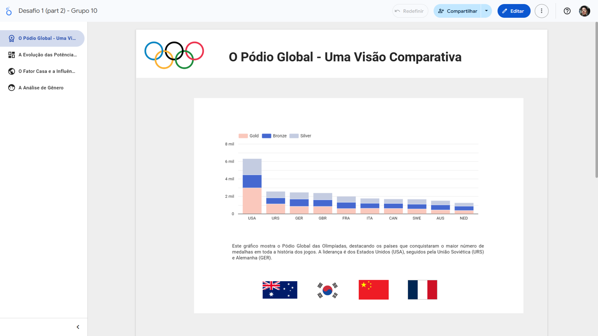
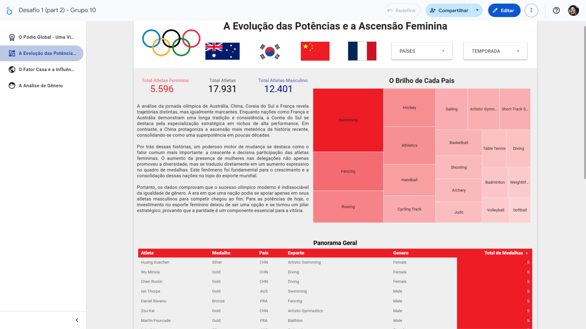
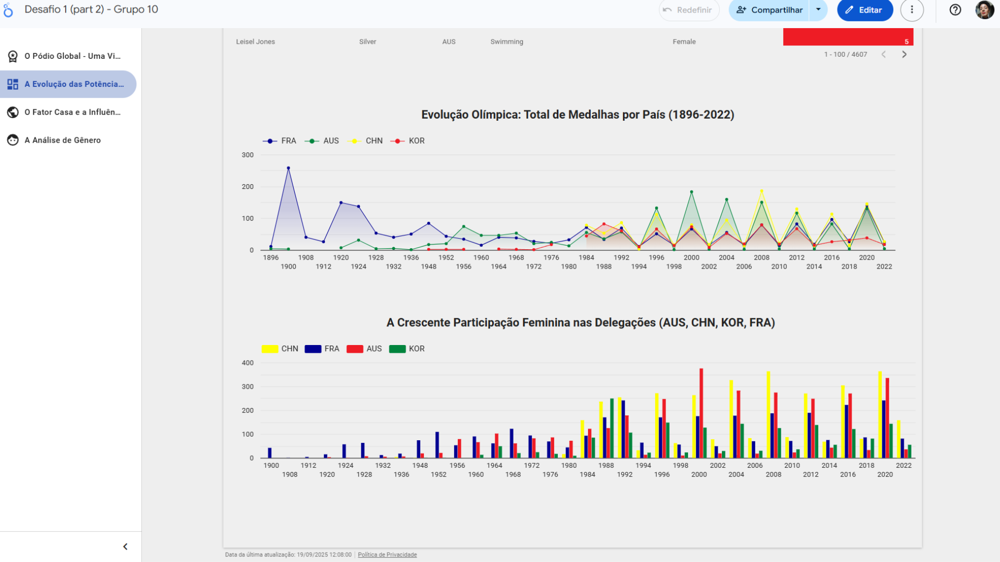
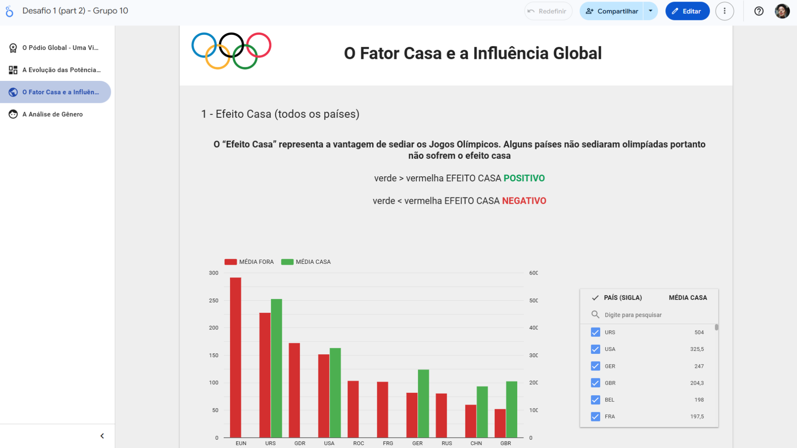
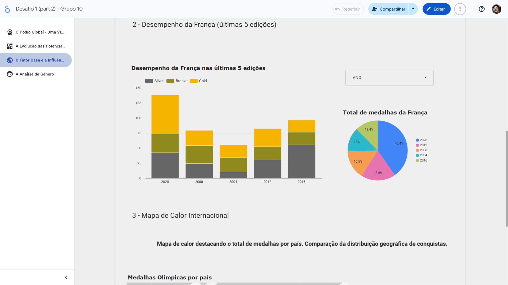
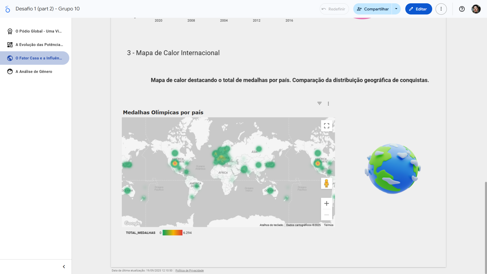
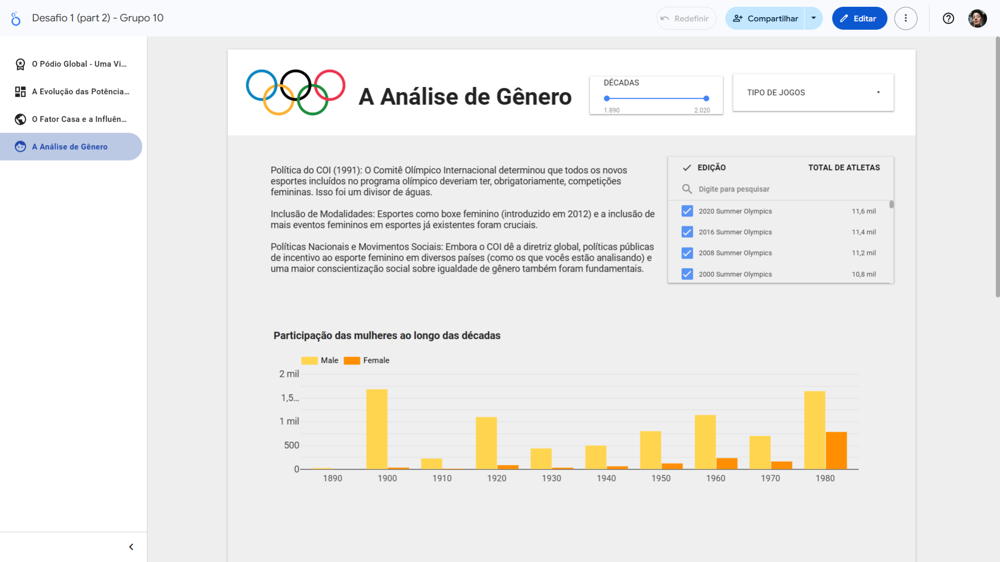
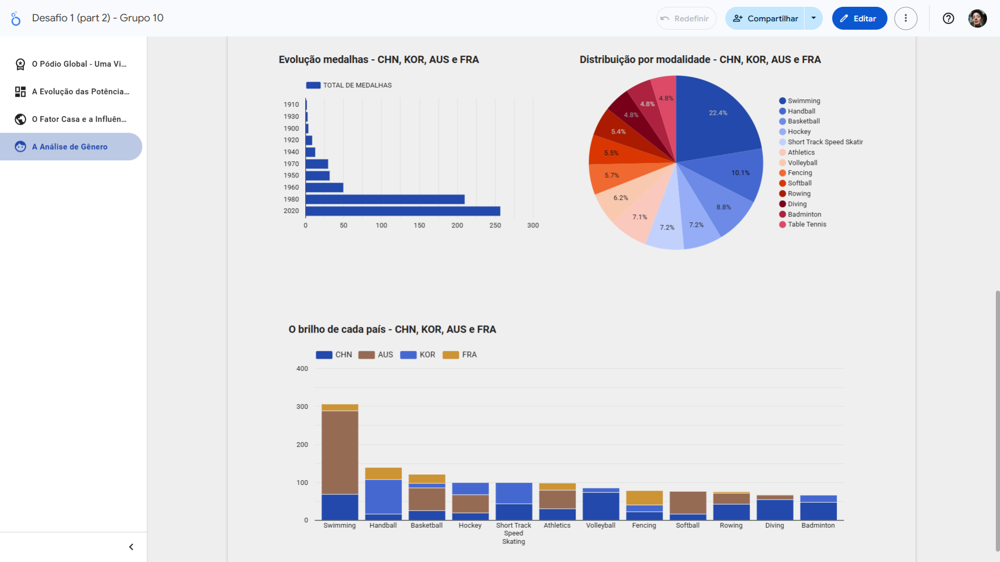

# Análise de Olimpíadas - Dashboard no Looker Studio

Este projeto apresenta um dashboard interativo criado no Google Looker Studio, analisando dados históricos das Olimpíadas sob diferentes perspectivas.

**[Clique aqui para acessar o relatório interativo](https://lookerstudio.google.com/reporting/980988cd-917d-4c99-a605-d4466e43bd1e)**

---

## 📸 Screenshots dos Dashboards

### 1. O Pódio Global
Visão geral do desempenho dos países, com foco no pódio e no total de medalhas.

### 2. A Evolução das Potências
Análise da evolução de potências olímpicas ao longo das edições.

### 3. O Fator Casa
Este dashboard explora se competir em casa realmente impacta o desempenho de um país.

### 4. Análise de Gênero
Comparativo da participação e do desempenho entre atletas masculinos e femininos.

---

## 🛠️ Ferramentas Utilizadas
* **Google Looker Studio**
* **Google Sheets / CSV**
